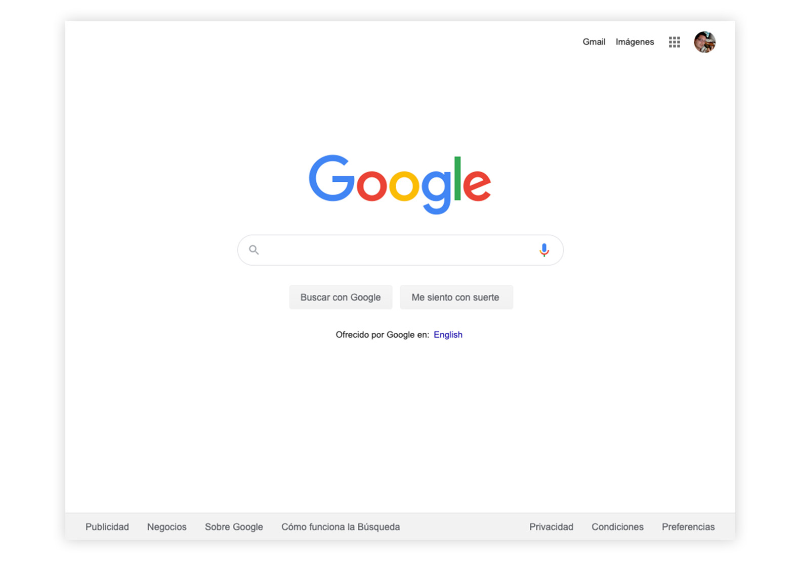

<h1 align="center">Welcome to Google Clone 👋</h1>

  
  
  

> Clon del Front Page de Google | HTML & CSS

### ✨ [Proyect](https://cjdiaz.github.io/google-clone/)

## Author

👤 **Carlos Diaz**

* Website: https://carlosdiaz.dev/
* Twitter: [@cjdiaz](https://twitter.com/cjdiaz)
* Github: [@cjdiaz](https://github.com/cjdiaz)
* LinkedIn: [@cjdiaz](https://linkedin.com/in/cjdiaz)

## Show your support

Give a ⭐️ if this project helped you!

## 📝 License

This project is [MIT](https://github.com/kefranabg/readme-md-generator/blob/master/LICENSE) licensed.

***
_Copyright © 2020 | Made with ❤️ by [Carlos Diaz](https://github.com/cjdiaz)_